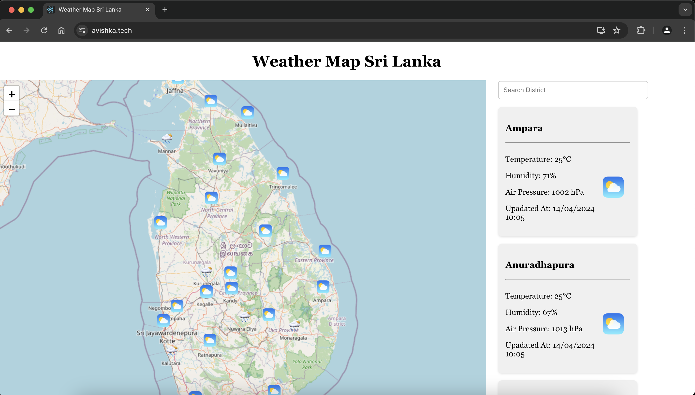
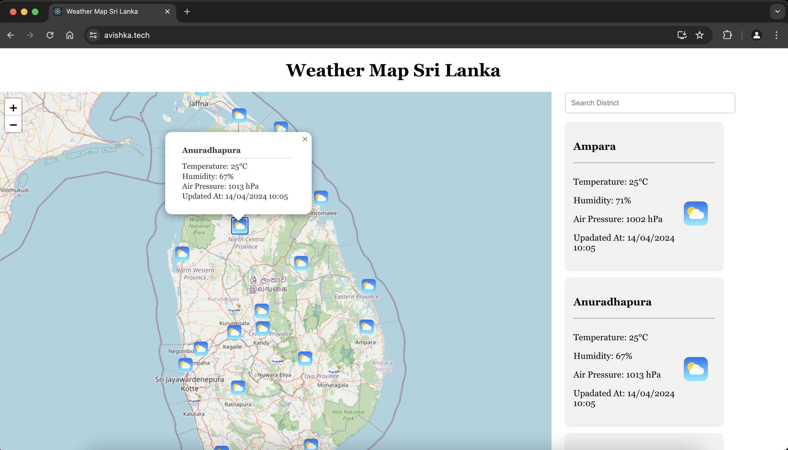
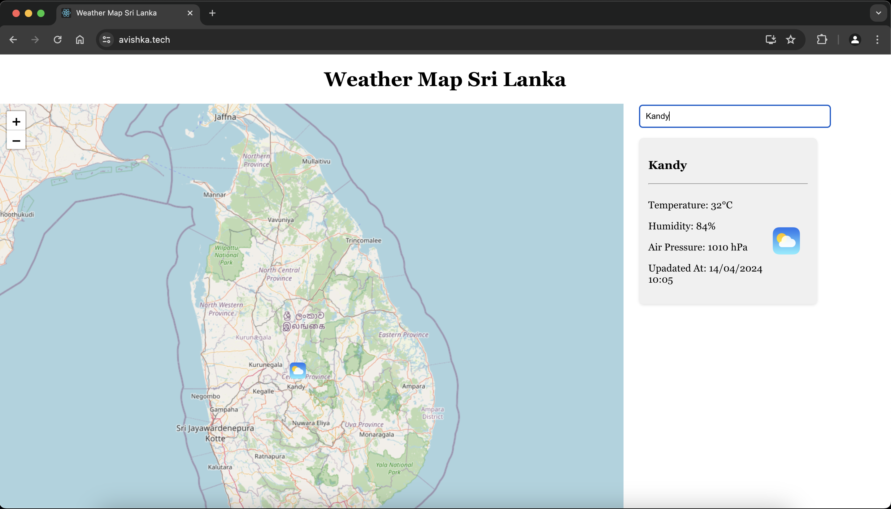
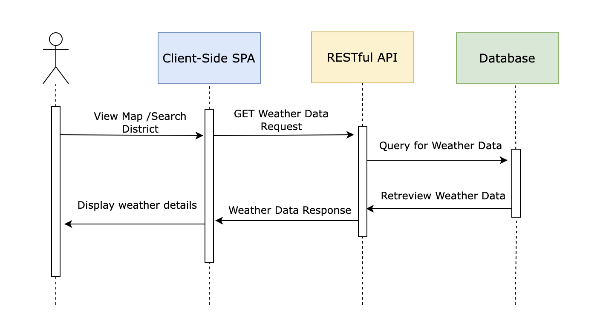
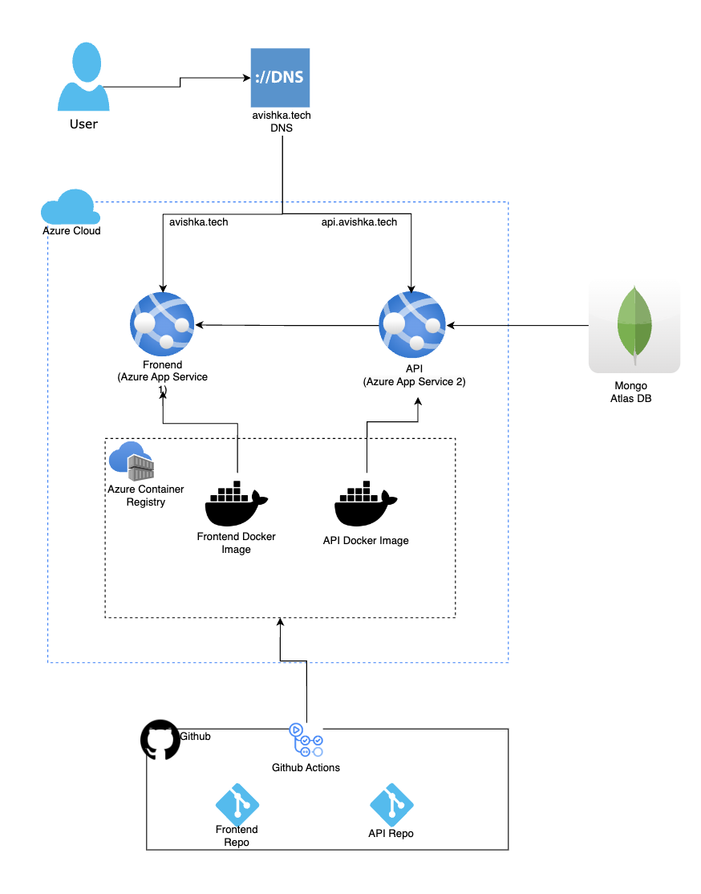

# Student ID : COBSCCOMP4Y222P-011

# WEATHER MAP FRONTEND

This project is a frontend application built with React that displays weather data on a map for 24 districts in Sri Lanka. The weather data includes temperature, humidity, air pressure, and the latest updated date. The data is synced from a backend API.

## DEMO

You can find a live demo of the application [here](https://avishka.tech/).


## FEATURES

- Displays weather data on a map for 24 districts in Sri Lanka.
- Shows temperature, humidity, air pressure, and the latest updated date.
- Includes a search option to find weather data for specific districts.

1. Weather Map:

   

2. Weather Details:

   

3. Search Functionality:

   

## Installation

1. Clone the repository:

```
git clone https://github.com/A-Samod/weather-api-frontend
```

2. Navigate to the project directory:

```
cd weather-api-frontend
```

3. Install dependencies:
```
npm install
```

4. Start the development server:
```
npm start
```
5. Open http://localhost:3000 to view it in the browser.

## Backend Repository

The backend repository for this project can be found [here](https://github.com/A-Samod/weather-api-backend).

## UML SEQUENCE DIAGRAM

 

 ## CLOUD ARCHITECTURE

 
